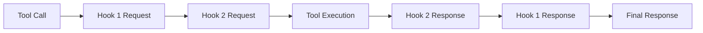

# @civic/hook-common

Common utilities and types for implementing MCP (Model Context Protocol) hooks. This package provides the core functionality for creating hooks that can intercept and modify tool calls in MCP servers.

## Installation

```bash
pnpm add @civic/hook-common
```

## Overview

The hook-common package provides:

- **Type definitions** for tool calls, hook responses, and metadata
- **Base client class** for implementing hooks
- **Utilities** for processing and validating hook interactions

## Core Concepts

### Tool Calls

A tool call represents a request to execute a specific tool with given arguments:

```typescript
interface ToolCall {
  name: string;
  arguments: unknown;
  metadata?: {
    sessionId: string;
    timestamp: string;
    source?: string;
  };
}
```

### Hook Responses

Hooks can respond with either "continue" (allowing the tool call to proceed) or "abort" (preventing execution):

```typescript
interface HookResponse {
  response: "continue" | "abort";
  body: unknown;
  reason?: string;
}
```

### Hook Client

The base class for implementing hooks:

```typescript
abstract class HookClient {
  abstract name: string;
  abstract processRequest(toolCall: ToolCall): Promise<HookResponse>;
  abstract processResponse(
    response: unknown,
    originalToolCall: ToolCall
  ): Promise<HookResponse>;
}
```

## Creating a Hook

To create a custom hook, extend the `HookClient` class:

```typescript
import { HookClient, ToolCall, HookResponse } from '@civic/hook-common';

export class MyCustomHook extends HookClient {
  name = 'my-custom-hook';

  async processRequest(toolCall: ToolCall): Promise<HookResponse> {
    // Analyze the tool call
    console.log(`Processing request for tool: ${toolCall.name}`);
    
    // Optionally modify the tool call
    const modifiedToolCall = {
      ...toolCall,
      arguments: {
        ...toolCall.arguments,
        injected: 'value'
      }
    };

    // Return response
    return {
      response: 'continue',
      body: modifiedToolCall
    };
  }

  async processResponse(
    response: unknown,
    originalToolCall: ToolCall
  ): Promise<HookResponse> {
    // Process the tool's response
    console.log(`Processing response for tool: ${originalToolCall.name}`);
    
    // Optionally modify the response
    return {
      response: 'continue',
      body: response
    };
  }
}
```

## Hook Execution Flow

1. **Request Processing**: When a tool is called, hooks process the request in order
2. **Tool Execution**: If all hooks return "continue", the tool executes
3. **Response Processing**: Hooks process the tool's response in reverse order



## Type Safety

All types are exported with Zod schemas for runtime validation:

```typescript
import { ToolCallSchema, HookResponseSchema } from '@civic/hook-common';

// Validate incoming data
const validatedToolCall = ToolCallSchema.parse(incomingData);

// Validate hook responses
const validatedResponse = HookResponseSchema.parse(hookResponse);
```

## Examples

### Logging Hook

```typescript
export class LoggingHook extends HookClient {
  name = 'logging-hook';

  async processRequest(toolCall: ToolCall): Promise<HookResponse> {
    console.log(`[${new Date().toISOString()}] Tool called: ${toolCall.name}`);
    console.log('Arguments:', JSON.stringify(toolCall.arguments, null, 2));
    
    return {
      response: 'continue',
      body: toolCall
    };
  }

  async processResponse(
    response: unknown,
    originalToolCall: ToolCall
  ): Promise<HookResponse> {
    console.log(`[${new Date().toISOString()}] Response from: ${originalToolCall.name}`);
    console.log('Response:', JSON.stringify(response, null, 2));
    
    return {
      response: 'continue',
      body: response
    };
  }
}
```

### Validation Hook

```typescript
export class ValidationHook extends HookClient {
  name = 'validation-hook';

  async processRequest(toolCall: ToolCall): Promise<HookResponse> {
    // Validate tool calls
    if (toolCall.name === 'dangerous-tool') {
      return {
        response: 'abort',
        body: null,
        reason: 'This tool is not allowed'
      };
    }
    
    return {
      response: 'continue',
      body: toolCall
    };
  }

  async processResponse(
    response: unknown,
    originalToolCall: ToolCall
  ): Promise<HookResponse> {
    return {
      response: 'continue',
      body: response
    };
  }
}
```

## API Reference

### Types

- `ToolCall` - Represents a tool invocation
- `HookResponse` - Response from a hook
- `ToolCallMetadata` - Optional metadata for tool calls

### Schemas

- `ToolCallSchema` - Zod schema for ToolCall validation
- `HookResponseSchema` - Zod schema for HookResponse validation
- `ToolCallMetadataSchema` - Zod schema for metadata validation

### Classes

- `HookClient` - Abstract base class for implementing hooks

## License

MIT